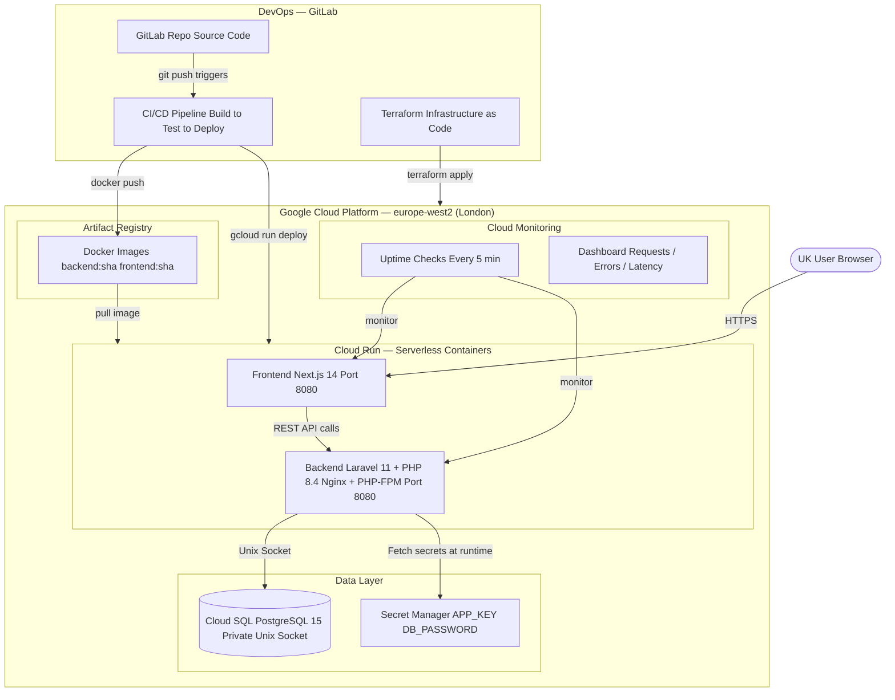
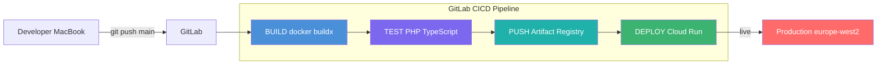
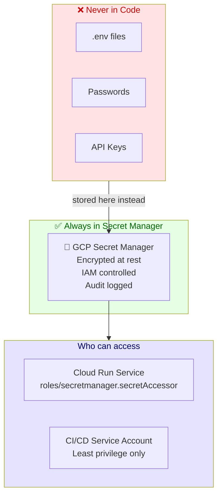
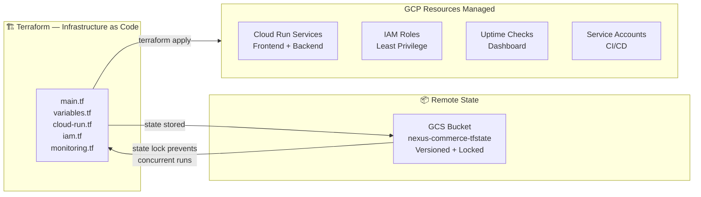
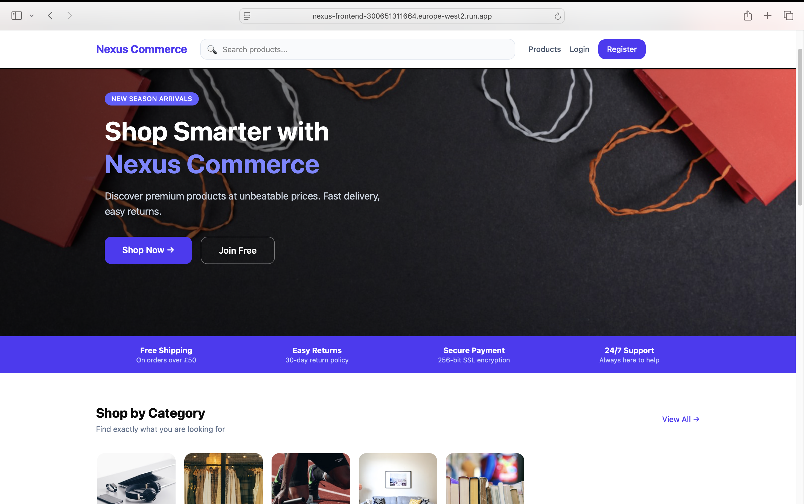
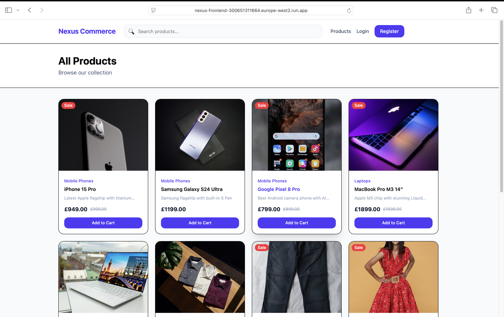
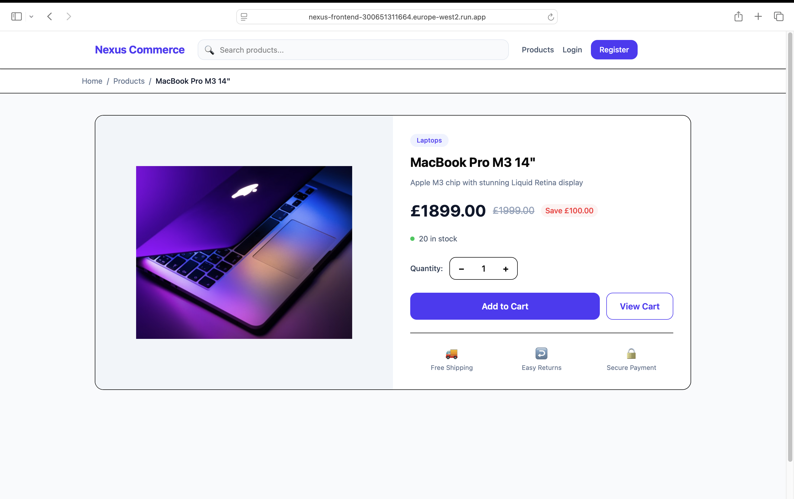
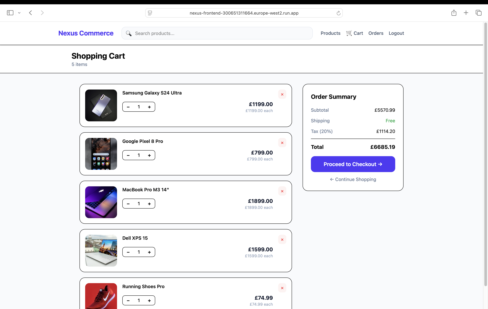
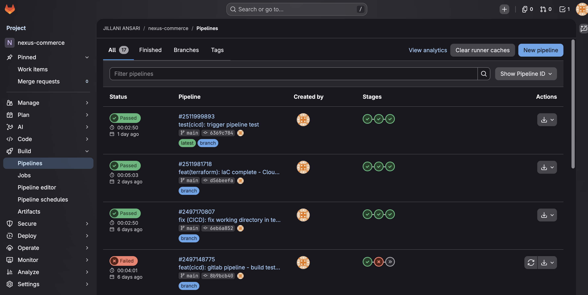

# Nexus Commerce

> A cloud-native e-commerce platform built with a full DevOps workflow — containerised services, automated CI/CD, infrastructure as code, and cloud deployment on GCP.

**Live:** https://nexus-frontend-300651311664.europe-west2.run.app


---

## Overview

Nexus Commerce is a full-stack e-commerce platform targeting the UK market. Customers can browse products by category, search, add to cart, place orders, and track purchases. The project is built to reflect how modern engineering teams ship software — not just "it works locally" but deployed, monitored, and automated.

**Why this project exists:** To demonstrate end-to-end DevOps ownership — from writing application code to running it reliably in the cloud with zero manual steps after a `git push`.

---
## Architecture



## CI/CD Pipeline


---
## Tech Stack

| Layer | Technology | Why |
|---|---|---|
| Frontend | Next.js 14, TypeScript | SSR for SEO, fast page loads |
| Backend | Laravel 11, PHP 8.4 | Clean REST API, Eloquent ORM |
| Database | PostgreSQL 15 | UUID support, JSON columns |
| Auth | Laravel Sanctum | Stateless token auth |
| Containers | Docker multi-stage | Small production images |
| Registry | GCP Artifact Registry | Versioned image storage |
| Deployment | GCP Cloud Run | Serverless, auto-scales to zero |
| Database hosting | GCP Cloud SQL | Managed, automated backups |
| Secrets | GCP Secret Manager | Zero credentials in codebase |
| CI/CD | GitLab CI/CD | Automated build → test → deploy |
| IaC | Terraform | Infrastructure reproducible from code |
| Monitoring | GCP Cloud Monitoring | Uptime checks, dashboard |
| State storage | GCP Cloud Storage | Terraform remote state |

---
## Security



## Infrastructure



## Run Locally

**Prerequisites:** Docker, Docker Compose

```bash
git clone https://github.com/YOUR_USERNAME/nexus-commerce.git
cd nexus-commerce/infra/docker
docker compose up -d
docker exec -it nexus_backend php artisan migrate:fresh --seed
```

- Frontend: http://localhost:3000
- Backend API: http://localhost:8000/api/v1

---

## Screenshots

> Homepage — Category browsing, featured products, hero banner



> Products Page — Search, filter by category, sale badges



> Product Detail — Image, price, stock status, add to cart



> Shopping Cart — Quantity controls, order summary, free shipping threshold



> GitLab CI/CD Pipeline — Build → Test → Deploy all passing




## Author

**Jillani Ansari** — Cloud & DevOps Engineer

[LinkedIn](https://linkedin.com/in/jillani05)
